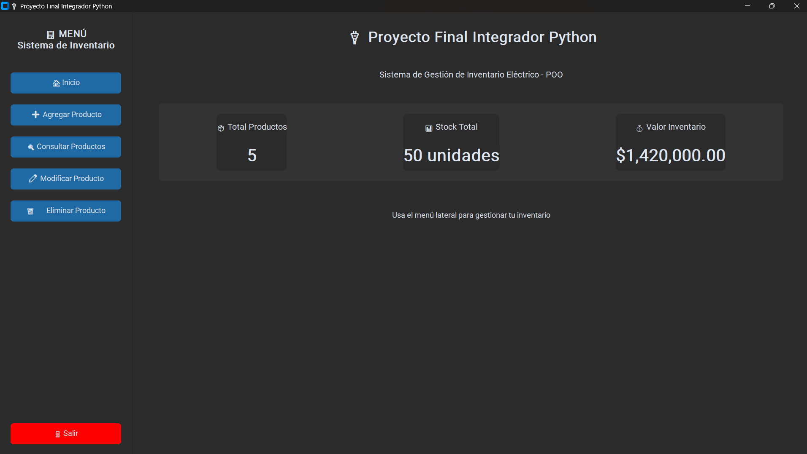
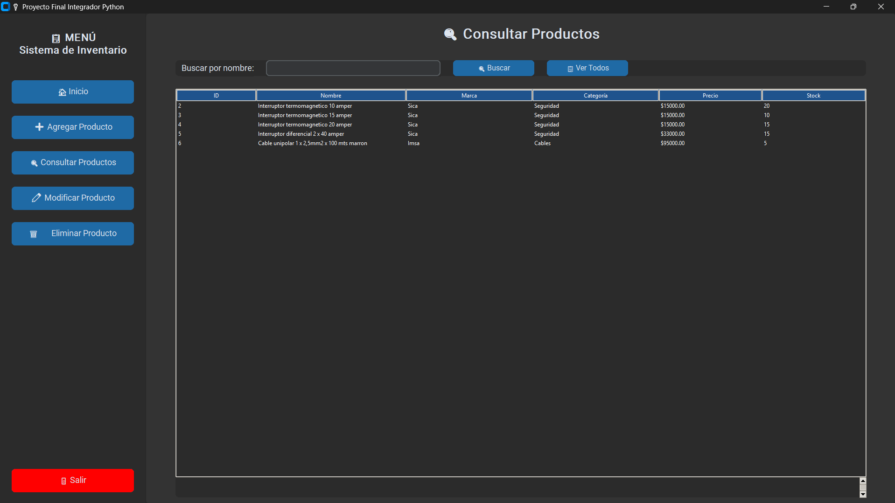
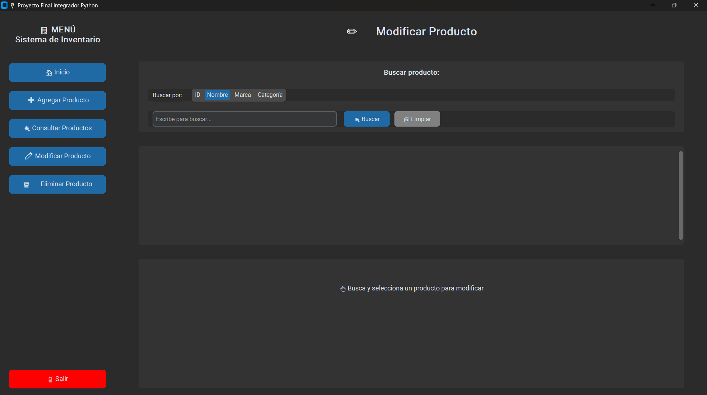
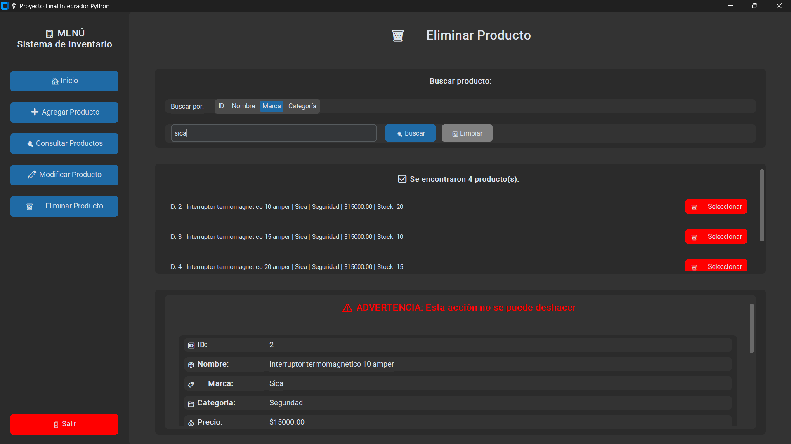

# 🎓 Proyecto Final Integrador Python

## Sistema de Gestión de Inventario Eléctrico

[](https://www.python.org/)
[](https://github.com/TomSchimansky/CustomTkinter)
[](https://www.sqlite.org/)
[]()

Sistema completo de gestión de inventario desarrollado como **Proyecto Final Integrador** del curso de Python, aplicando **Programación Orientada a Objetos (POO)** y el patrón arquitectónico **MVC (Modelo-Vista-Controlador)**.

**Desarrollado por:** Jonatan Churruarin  
**Año:** 2024/2025  
**Versión:** 1.0.0

---

## 📋 Tabla de Contenidos

- [Descripción](#-descripción)
- [Demostración](#-demostración)
- [Características](#-características)
- [Arquitectura](#-arquitectura)
- [Instalación](#-instalación)
- [Uso](#-uso)
- [Estructura del Proyecto](#-estructura-del-proyecto)
- [Tecnologías](#-tecnologías)
- [Conceptos Aplicados](#-conceptos-aplicados)
- [Capturas de Pantalla](#-capturas-de-pantalla)
- [Autor](#-autor)

---

## 📝 Descripción

Sistema profesional de gestión de inventario para productos eléctricos que implementa las operaciones CRUD completas (Crear, Leer, Actualizar, Eliminar) con una arquitectura modular y escalable.

### 🎯 Objetivos del Proyecto

- ✅ Aplicar **Programación Orientada a Objetos** (POO)
- ✅ Implementar el patrón **MVC** (Modelo-Vista-Controlador)
- ✅ Desarrollar operaciones **CRUD** completas
- ✅ Crear una **interfaz gráfica moderna**
- ✅ Implementar **persistencia de datos** con SQLite
- ✅ Aplicar **validaciones** y manejo de errores
- ✅ Desarrollar **búsqueda avanzada** por múltiples criterios
- ✅ Crear código **modular y mantenible**

---

## 🎬 Demostración

El sistema ofrece dos interfaces:
- **🖥️ Interfaz Gráfica (GUI)**: App de escritorio moderna con CustomTkinter
- **⌨️ Interfaz de Terminal (CLI)**: Menú interactivo en consola

---

## ✨ Características

### 🏠 Dashboard Inteligente
- **Métricas en tiempo real**: Total de productos, stock total, valor del inventario
- **Estadísticas visuales**: Tarjetas con información clave
- **Actualización automática**: Los datos se refrescan al modificar el inventario

### ➕ Gestión de Productos

#### Agregar Productos
- Formulario intuitivo con campos validados
- Campos: nombre, marca, categoría, precio, stock, descripción
- Validaciones automáticas mediante properties de Python
- Confirmación visual de éxito

#### 🔍 Consultar Productos
- Búsqueda rápida por nombre
- Vista en tabla interactiva
- Scroll automático para muchos productos
- Botón "Ver Todos" para listar el inventario completo

#### ✏️ Modificar Productos
- **Sistema de búsqueda inteligente** por:
  - 🆔 ID (búsqueda exacta)
  - 📝 Nombre (búsqueda parcial)
  - 🏷️ Marca (filtro)
  - 📂 Categoría (filtro)
- Vista previa de resultados
- Formulario pre-cargado con datos actuales
- Actualización campo por campo
- Botón verde destacado para guardar cambios

#### 🗑️ Eliminar Productos
- **Búsqueda avanzada** (ID, Nombre, Marca, Categoría)
- Vista previa completa del producto
- **Doble confirmación**:
  1. Checkbox de confirmación
  2. Diálogo de confirmación final
- Advertencias de seguridad visibles
- Imposible eliminar por error

---

## 🏗️ Arquitectura

### Patrón MVC Implementado

```
┌─────────────────────────────────────────┐
│           VISTA (View)                  │
│  ┌─────────────┐    ┌─────────────┐     │
│  │  GUI (CTk)  │    │  CLI (Menu) │     │
│  └─────────────┘    └─────────────┘     │
└─────────────┬───────────────────────────┘
              │
              ↓
┌─────────────────────────────────────────┐
│      CONTROLADOR (Controller)           │
│      ┌───────────────────────┐          │
│      │  GestorInventario     │          │
│      │  - Lógica de negocio  │          │
│      │  - Validaciones       │          │
│      └───────────────────────┘          │
└─────────────┬───────────────────────────┘
              │
              ↓
┌─────────────────────────────────────────┐
│         MODELO (Model)                  │
│  ┌──────────────┐  ┌──────────────┐     │
│  │  Producto    │  │ InventarioDB │     │
│  │  (Entidad)   │  │  (SQLite)    │     │
│  └──────────────┘  └──────────────┘     │
└─────────────────────────────────────────┘
```

### Arquitectura Modular

El código GUI está dividido en **7 módulos independientes**:

| Archivo | Líneas | Responsabilidad |
|---------|--------|-----------------|
| `app_desktop.py` | ~70 | Coordinador principal |
| `menu_lateral.py` | ~50 | Menú de navegación |
| `pantalla_inicio.py` | ~60 | Dashboard |
| `pantalla_agregar.py` | ~80 | Formulario de alta |
| `pantalla_consultar.py` | ~90 | Búsqueda y listado |
| `pantalla_modificar.py` | ~180 | Búsqueda y modificación |
| `pantalla_eliminar.py` | ~180 | Búsqueda y eliminación |

**Antes:** 800 líneas en 1 archivo  
**Ahora:** 7 archivos modulares de 50-180 líneas

---

## 🚀 Instalación

### Requisitos Previos
- **Python 3.8 o superior**
- pip (gestor de paquetes de Python)
- Git (opcional, para clonar el repositorio)

### Opción 1: Clonar desde GitHub

```bash
git clone https://github.com/jochurru/Proyecto_Final_Integrador_Python.git
cd Proyecto_Final_Integrador_Python
```

### Opción 2: Descargar ZIP

1. Click en el botón verde "Code"
2. Selecciona "Download ZIP"
3. Extrae el archivo
4. Abre la carpeta en terminal

### Configuración del Entorno

#### 1. Crear entorno virtual (Recomendado)

**Windows:**
```bash
python -m venv venv
venv\Scripts\activate
```

**Linux/Mac:**
```bash
python3 -m venv venv
source venv/bin/activate
```

#### 2. Instalar dependencias

```bash
pip install -r requirements.txt
```

---

## 💻 Uso

### Opción 1: Interfaz Gráfica (Recomendado) 🖥️

```bash
python app_desktop.py
```

Se abrirá una ventana con la aplicación de escritorio moderna.

**Navegación:**
- Usa el menú lateral para cambiar entre secciones
- Los botones son grandes e intuitivos
- Tema oscuro por defecto (configurable)

### Opción 2: Interfaz de Terminal 📟

```bash
python main.py
```

Se ejecutará el menú interactivo en la terminal.

**Navegación:**
- Ingresa el número de la opción deseada
- Sigue las instrucciones en pantalla
- Los datos se validan automáticamente

---

## 📁 Estructura del Proyecto

```
Proyecto_Final_Integrador_Python/
│
├── 📄 main.py                          # CLI - Interfaz de terminal
├── 📄 app_desktop.py                   # GUI - Aplicación de escritorio (principal)
│
├── 📂 models/                          # MODELO (Datos y Persistencia)
│   ├── __init__.py
│   ├── producto.py                     # Clase Producto con validaciones
│   └── database.py                     # Clase InventarioDB (SQLite)
│
├── 📂 controllers/                     # CONTROLADOR (Lógica de Negocio)
│   ├── __init__.py
│   └── gestor_inventario.py           # Clase GestorInventario
│
├── 📂 views/                           # VISTA (Interfaces)
│   ├── __init__.py
│   ├── menu.py                         # Interfaz CLI
│   │
│   └── 📂 gui/                         # Interfaz GUI (Modularizada)
│       ├── __init__.py
│       ├── menu_lateral.py             # Menú de navegación
│       ├── pantalla_inicio.py          # Dashboard
│       ├── pantalla_agregar.py         # Formulario agregar
│       ├── pantalla_consultar.py       # Búsqueda y tabla
│       ├── pantalla_modificar.py       # Búsqueda y modificación
│       └── pantalla_eliminar.py        # Búsqueda y eliminación
│
├── 📄 inventario.db                    # Base de datos SQLite (auto-generada)
├── 📄 requirements.txt                 # Dependencias del proyecto
├── 📄 .gitignore                       # Archivos ignorados por Git
└── 📄 README.md                        # Este archivo
```

---

## 🛠️ Tecnologías

### Lenguaje y Librerías

| Tecnología | Versión | Uso |
|------------|---------|-----|
| **Python** | 3.8+ | Lenguaje principal |
| **SQLite3** | 3.x | Base de datos embebida |
| **CustomTkinter** | 5.2.2 | Interfaz gráfica moderna |
| **Tkinter** | Incluido | Base para CustomTkinter |

### Paradigmas y Patrones

- **POO** (Programación Orientada a Objetos)
- **MVC** (Modelo-Vista-Controlador)
- **Modularización**
- **Separación de Responsabilidades**

---

## 🎓 Conceptos Aplicados

### 1. Programación Orientada a Objetos

#### Encapsulación
```python
class Producto:
    def __init__(self, nombre, marca, ...):
        self._nombre = nombre  # Atributo privado
        self._precio = precio
```

#### Properties con Validación
```python
@property
def precio(self):
    return self._precio

@precio.setter
def precio(self, valor):
    if valor < 0:
        raise ValueError("El precio no puede ser negativo")
    self._precio = float(valor)
```

#### Métodos de Clase
```python
@classmethod
def from_tuple(cls, tupla):
    return cls(id_producto=tupla[0], nombre=tupla[1], ...)
```

### 2. Patrón MVC

- **Modelo**: Maneja datos y lógica de persistencia
- **Vista**: Presenta información al usuario
- **Controlador**: Coordina Modelo y Vista

### 3. Principios SOLID

- **SRP** (Single Responsibility Principle): Cada clase tiene una responsabilidad
- **OCP** (Open/Closed Principle): Abierto a extensión, cerrado a modificación
- **DIP** (Dependency Inversion): Depender de abstracciones

### 4. Buenas Prácticas

✅ **Validación de datos** en múltiples capas  
✅ **Manejo de errores** con try-except  
✅ **Docstrings** en funciones y clases  
✅ **Nombres descriptivos** de variables  
✅ **Código modular** y reutilizable  
✅ **Separación de responsabilidades**  

---

## 📊 Base de Datos

### Esquema de la tabla `productos`

```sql
CREATE TABLE productos (
    id INTEGER PRIMARY KEY AUTOINCREMENT,
    nombre TEXT NOT NULL,
    marca TEXT,
    categoria TEXT,
    precio REAL NOT NULL,
    stock INTEGER NOT NULL,
    descripcion TEXT
);
```

| Campo | Tipo | Restricción | Descripción |
|-------|------|-------------|-------------|
| `id` | INTEGER | PRIMARY KEY | Identificador único |
| `nombre` | TEXT | NOT NULL | Nombre del producto |
| `marca` | TEXT | - | Marca/fabricante |
| `categoria` | TEXT | - | Categoría del producto |
| `precio` | REAL | NOT NULL | Precio unitario |
| `stock` | INTEGER | NOT NULL | Cantidad disponible |
| `descripcion` | TEXT | - | Descripción detallada |

---

## 📸 Capturas de Pantalla

### Dashboard Principal

*Vista principal con métricas en tiempo real*

### Agregar Producto

*Formulario para dar de alta productos*

### Búsqueda Avanzada

*Sistema de búsqueda por múltiples criterios*

### Modificar Producto

*Edición de productos existentes*

### Eliminar con Confirmación

*Eliminación segura con doble confirmación*


---

## 🧪 Testing (Opcional)

Para ejecutar tests unitarios:

```bash
# Instalar pytest
pip install pytest

# Ejecutar tests
pytest tests/ -v
```

---

## 🚀 Mejoras Futuras

### Funcionalidades Planificadas

- [ ] 📊 Exportación a Excel/CSV
- [ ] 📈 Gráficos de estadísticas con matplotlib
- [ ] 👥 Sistema de usuarios y permisos
- [ ] 📜 Historial de cambios (auditoría)
- [ ] 💾 Backup automático de base de datos
- [ ] 🌐 API REST con FastAPI
- [ ] 📄 Generación de reportes en PDF
- [ ] 🔔 Notificaciones de stock bajo
- [ ] 📱 Versión móvil con Kivy
- [ ] ☁️ Sincronización en la nube

---

## 👨‍💻 Autor

**Jonatan Churruarin**  
Proyecto Final Integrador - Curso de Python

### Especialización
- Desarrollo de sistemas con Python
- Arquitectura de software limpia (MVC, POO)
- Bases de datos relacionales (SQLite, MySQL)
- Interfaces gráficas de usuario (GUI)
- Modularización y buenas prácticas

### Contacto
- 🐙 GitHub: [@jochurru](https://github.com/jochurru)
- 📧 Email: [jonatan.churruarin@outlook.com]
- 💼 LinkedIn: [www.linkedin.com/in/jonatan-churruarin]

---

## 📄 Licencia

Este proyecto fue desarrollado como trabajo académico para el curso de Python.  
**Uso educativo y de portfolio.**

---

## 🙏 Agradecimientos

- A mi profesora de Python por la guía durante el curso
- A la comunidad de Python por la excelente documentación
- A los desarrolladores de CustomTkinter por la librería
- A todos los que contribuyeron con feedback

---

## ⭐ Estado del Proyecto

✅ **Proyecto Final Integrador Completado**  
🎓 **Aplicación práctica de POO y MVC**  
🛠️ **Funcional y listo para producción**  
📚 **Completamente documentado**  
🎯 **Código profesional y mantenible**  
🏆 **Listo para presentación académica**

---

## 📞 Soporte

Si encuentras algún problema o tienes sugerencias:

1. Abre un [Issue en GitHub](https://github.com/jochurru/Proyecto_Final_Integrador_Python/issues)
2. Contacta al autor por email
3. Revisa la [documentación](#-tabla-de-contenidos)

---

## 🎯 Instalación Rápida (TL;DR)

```bash
# Clonar
git clone https://github.com/jochurru/Proyecto_Final_Integrador_Python.git
cd Proyecto_Final_Integrador_Python

# Instalar
pip install -r requirements.txt

# Ejecutar
python app_desktop.py
```

---

<div align="center">

**Fecha de entrega:** [12/2025]  
**Versión:** 1.0.0  
**Python:** 3.8+  
**Última actualización:** Diciembre 2025

---

### ⭐ Si este proyecto te resultó útil, dale una estrella ⭐

**Desarrollado con ❤️ por Jonatan Churruarin**

</div>

---
